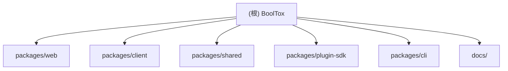

# BoolTox（不二工具箱） - AI 开发指南

> 最后更新：2025-12-10 21:36:05

---

## 变更记录（Changelog）

| 时间 | 操作 | 说明 |
|------|------|------|
| 2025-12-10 21:36 | 首次生成 | 基于当前代码仓初始化 AI 上下文 |

---

## 项目愿景

BoolTox 是一个**开源、可扩展的 Web + Electron 混合工具箱平台**，支持插件生态，提供：
- **Web 优先**：零安装门槛，浏览器即用
- **插件生态**：丰富的插件市场，一键安装（GitOps + jsDelivr CDN）
- **本地 Agent（可选）**：Electron 客户端提供原生系统权限与高性能执行
- **隐私优先**：本地运行，开源透明

---

## 架构总览

```
┌─────────────────┐
│   Web 前端       │  ← Next.js 15, React 19
│  (浏览器访问)    │     零安装，SEO 友好
└────────┬────────┘
         │ HTTP/WebSocket
┌────────▼────────┐
│  本地 Agent      │  ← Electron 38 + Vite
│  (可选安装)      │     进程调度，系统权限
└────────┬────────┘
         │
┌────────▼────────┐
│   插件生态       │  ← TypeScript, Python
│  (独立仓库)      │     可选安装，热插拔
└─────────────────┘
```

**核心理念**：
- **Web 为主体**：所有用户首先访问 Web，Agent 是增强选项
- **插件隔离**：插件托管在独立仓库 `booltox-plugins`（本仓库已通过 `.gitignore` 排除）
- **GitOps 插件市场**：`plugins/index.json` 托管在 GitHub，通过 jsDelivr CDN 分发

---

## 模块结构图（Mermaid）



---

## 模块索引

| 模块路径 | 职责描述 | 语言 | 入口文件 |
|---------|---------|-----|---------|
| [packages/web](./packages/web/CLAUDE.md) | Next.js 前端（主站 + 插件市场 + 资源导航） | TypeScript | `src/app/layout.tsx` |
| [packages/client](./packages/client/CLAUDE.md) | Electron 客户端（可选本地 Agent） | TypeScript + Electron | `src/main/*.ts` (Electron Main) |
| [packages/shared](./packages/shared/CLAUDE.md) | 共享类型与工具（API/Protocol/Types） | TypeScript | `src/index.ts` |
| [packages/plugin-sdk](./packages/plugin-sdk/CLAUDE.md) | 插件开发 SDK（运行时 API 封装） | TypeScript | `src/index.ts` |
| [packages/cli](./packages/cli/CLAUDE.md) | 插件开发 CLI（create/dev/build/pack） | TypeScript + Node.js | `bin/booltox.js` |
| docs/ | 文档索引（产品/插件/历史） | Markdown | `docs/README.md` |

---

## 运行与开发

### 环境要求
- Node.js >= 20.0.0
- pnpm >= 8.0.0
- Python >= 3.12（可选，用于 Python 插件）

### 快速启动
```bash
# 安装依赖
pnpm install

# 启动 Web 前端（开发模式）
pnpm dev:web

# 启动 Electron 客户端（开发模式）
pnpm --filter @booltox/client dev
```

### 构建
```bash
# 构建所有包
pnpm build

# 仅构建 Web
pnpm --filter @booltox/web build

# 仅构建 Electron 客户端
pnpm --filter @booltox/client build
```

---

## 测试策略

### Web 端
- **无专用测试**：当前依赖 Next.js 的类型检查 + ESLint
- **建议**：未来可添加 Vitest + React Testing Library

### Client 端
- **单元测试**：Jest + `@testing-library/react`
- **运行测试**：`pnpm --filter @booltox/client test`

### Shared / Plugin-SDK
- **类型检查**：`pnpm type-check`（依赖 TypeScript 编译器）

---

## 编码规范

1. **语言**：简体中文（代码注释、commit 信息）
2. **包管理器**：pnpm（monorepo 通过 Turbo 管理）
3. **格式化**：
   - Prettier（配置在各 package.json 的 `lint-staged`）
   - ESLint（Next.js 默认规则 + TypeScript 严格模式）
4. **Commit 规范**：
   - 遵循 Conventional Commits（如 `feat:`, `fix:`, `docs:`）
   - 通过 Husky + lint-staged 强制格式化

---

## AI 使用指引

### 核心原则
1. **简洁优先**：不过度设计，先解决实际问题
2. **数据结构先行**：代码质量 = 数据结构质量
3. **消除特殊情况**：好代码没有 `if/else` 边界补丁
4. **向后兼容**：永远不破坏已有插件/API

### 修改代码时
- **必读模块 CLAUDE.md**：先查看对应模块的本地文档
- **不破坏类型安全**：`shared` 和 `plugin-sdk` 的类型变更必须向后兼容
- **插件 API 是合约**：一旦发布，`plugin-sdk` 的公开接口不能随意修改

### 推荐工作流
1. 阅读 `docs/README.md` 了解产品背景
2. 查看目标模块的 `CLAUDE.md`（如 `packages/web/CLAUDE.md`）
3. 通过 Grep/Glob 定位具体实现文件
4. 修改前运行 `pnpm type-check` 和 `pnpm lint`

---

## 相关资源

- **在线体验**：https://booltox.com
- **插件市场**：https://booltox.com/tools/market
- **GitHub 仓库**：https://github.com/ByteTrue/BoolTox
- **插件仓库**：https://github.com/ByteTrue/booltox-plugins（独立维护）
- **文档索引**：[docs/README.md](./docs/README.md)

---

## 下一步建议

当前 AI 上下文已覆盖：
- ✅ 根级架构与模块清单
- ✅ 各模块 package.json 与依赖关系
- ✅ 关键入口文件（layout/page）
- ⚠️ 待补充：各模块详细 `CLAUDE.md`（下一步将生成）

**推荐操作**：
1. 阅读各模块的 `CLAUDE.md`（即将生成）
2. 如需深入某模块，运行 `pnpm --filter <package-name> dev`
3. 遇到插件问题，参考 `docs/plugins/development-guide.md`
