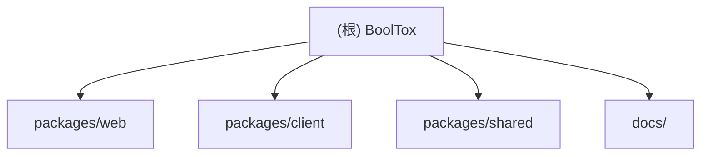

# BoolTox - AI 开发指南

> 最后更新：2025-12-12 15:30:00

---

## 变更记录（Changelog）

| 时间 | 操作 | 说明 |
|------|------|------|
| 2025-12-12 15:30 | 架构重构完成 | 移除 webview 架构，统一为 http-service/standalone 模式 |
| 2025-12-10 21:36 | 首次生成 | 基于当前代码仓初始化 AI 上下文 |

---

## 项目愿景

BoolTox 是一个**开源、可扩展的 Web + Electron 混合工具箱平台**，支持工具生态，提供：
- **Web 优先**：零安装门槛，浏览器即用
- **工具生态**：丰富的工具市场，一键安装（GitOps + jsDelivr CDN）
- **本地 Agent（可选）**：Electron 客户端提供进程管理与依赖环境
- **隐私优先**：本地运行，开源透明

**核心理念**：**BoolTox = 进程管理器 + 工具市场**，不是工具运行容器

---

## 架构总览

```
┌─────────────────┐
│   Web 前端       │  ← Next.js 15, React 19
│  (浏览器访问)    │     零安装，SEO 友好
└────────┬────────┘
         │ HTTP/WebSocket
┌────────▼────────┐
│  本地 Agent      │  ← Electron 38 + Vite
│ (进程管理器)     │     启动/停止工具进程
└────────┬────────┘
         │
┌────────▼────────┐
│   工具生态       │  ← 完全独立的工具
│ (http-service)   │     在系统浏览器中运行
│  (standalone)    │     或使用原生窗口
└─────────────────┘
```

### 工具架构

BoolTox 支持两种工具类型：

#### 1. HTTP Service 模式（推荐）
工具启动自己的 HTTP 服务器，在系统默认浏览器中显示：

```
用户启动工具
    ↓
BoolTox 启动进程 (python/node)
    ↓
工具启动 HTTP 服务器 (FastAPI/Express)
    ↓
BoolTox 健康检查 → 打开浏览器
```

**特点**：
- ✅ 工具完全独立，可手动启动：`python tool.py` 或 `node tool.js`
- ✅ 不依赖任何 BoolTox SDK
- ✅ 在系统默认浏览器中运行，零兼容问题
- ✅ 用户获得完整的浏览器功能

**示例**：
- backend-demo (Python + FastAPI)
- backend-node-demo (Node.js + Express)
- frontend-only-demo (Node.js + 静态文件服务)

#### 2. Standalone 模式
工具创建自己的原生窗口（Qt、Tkinter 等）：

**特点**：
- ✅ 原生 GUI 界面，性能优秀
- ✅ 完全独立运行
- ✅ 适合需要系统级别窗口管理的场景

**示例**：
- python-standalone-demo (PySide6 + QFluentWidgets)

---

## 模块结构图（Mermaid）



---

## 模块索引

| 模块路径 | 职责描述 | 语言 | 入口文件 |
|---------|---------|-----|---------|
| [packages/web](./packages/web/CLAUDE.md) | Next.js 前端（主站 + 工具市场 + 资源导航） | TypeScript | `src/app/layout.tsx` |
| [packages/client](./packages/client/CLAUDE.md) | Electron 客户端（进程管理 + 依赖环境） | TypeScript + Electron | `electron/main.ts` |
| [packages/shared](./packages/shared/CLAUDE.md) | 共享类型与协议（ToolRuntimeConfig 等） | TypeScript | `src/index.ts` |
| docs/ | 文档索引（产品/工具/历史） | Markdown | `docs/README.md` |

**注意**：`packages/tool-sdk` 已废弃，新架构的工具完全独立，不需要 SDK。

---

## 运行与开发

### 环境要求
- Node.js >= 20.0.0
- pnpm >= 8.0.0
- Python >= 3.12（可选，用于 Python 插件）

### 快速启动
```bash
# 安装依赖
pnpm install

# 启动 Web 前端（开发模式）
pnpm dev:web

# 启动 Electron 客户端（开发模式）
pnpm --filter @booltox/client dev
```

### 构建
```bash
# 构建所有包
pnpm build

# 仅构建 Web
pnpm --filter @booltox/web build

# 仅构建 Electron 客户端
pnpm --filter @booltox/client build
```

---

## 测试策略

### Web 端
- **无专用测试**：当前依赖 Next.js 的类型检查 + ESLint
- **建议**：未来可添加 Vitest + React Testing Library

### Client 端
- **单元测试**：Jest + `@testing-library/react`
- **运行测试**：`pnpm --filter @booltox/client test`

### Shared / Plugin-SDK
- **类型检查**：`pnpm type-check`（依赖 TypeScript 编译器）

---

## 编码规范

1. **语言**：简体中文（代码注释、commit 信息）
2. **包管理器**：pnpm（monorepo 通过 Turbo 管理）
3. **格式化**：
   - Prettier（配置在各 package.json 的 `lint-staged`）
   - ESLint（Next.js 默认规则 + TypeScript 严格模式）
4. **Commit 规范**：
   - 遵循 Conventional Commits（如 `feat:`, `fix:`, `docs:`）
   - 通过 Husky + lint-staged 强制格式化

---

## AI 使用指引

### 核心原则
1. **简洁优先**：不过度设计，先解决实际问题
2. **数据结构先行**：代码质量 = 数据结构质量
3. **消除特殊情况**：好代码没有 `if/else` 边界补丁
4. **向后兼容**：永远不破坏已有插件/API

### 修改代码时
- **必读模块 CLAUDE.md**：先查看对应模块的本地文档
- **不破坏类型安全**：`shared` 的类型变更必须向后兼容
- **工具 API 是合约**：`ToolRuntimeConfig` 等类型一旦发布不能随意修改
- **工具独立性**：新工具应使用 http-service 或 standalone 模式，不依赖 BoolTox SDK

### 推荐工作流
1. 阅读 `docs/README.md` 了解产品背景
2. 查看目标模块的 `CLAUDE.md`（如 `packages/client/CLAUDE.md`）
3. 通过 Grep/Glob 定位具体实现文件
4. 修改前运行 `pnpm type-check` 和 `pnpm lint`
5. 查看示例工具了解最佳实践（`packages/client/examples/`）

---

## 相关资源

- **在线体验**：https://booltox.com
- **工具市场**：https://booltox.com/tools/market
- **GitHub 仓库**：https://github.com/ByteTrue/BoolTox
- **工具仓库**：https://github.com/ByteTrue/booltox-tools（独立维护）
- **文档索引**：[docs/README.md](./docs/README.md)
- **重构计划**：[REFACTOR_PLAN.md](./REFACTOR_PLAN.md)

---

## 下一步建议

当前 AI 上下文已覆盖：
- ✅ 根级架构与模块清单
- ✅ 新架构说明（http-service/standalone）
- ✅ 各模块 package.json 与依赖关系
- ✅ 关键入口文件与示例工具

**推荐操作**：
1. 阅读各模块的 `CLAUDE.md` 了解详细实现
2. 查看 `packages/client/examples/` 下的示例工具
3. 参考 `REFACTOR_PLAN.md` 了解架构演进
4. 如需深入某模块，运行 `pnpm --filter <package-name> dev`
