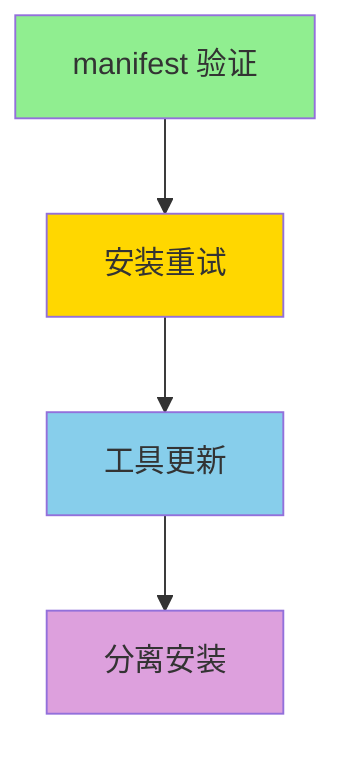

# BoolTox P1 剩余功能实施指南

> 创建时间：2025-12-13
> 状态：设计完成，待实施

---

## 已完成 P1 功能（6/7）

✅ 1. 工具分类和截图预览
✅ 2. 拖拽添加本地工具（组件已创建）
✅ 3. 批量操作
📝 4. manifest.json 验证优化（设计完成，待实施）
📝 5. 工具更新检查和提示（设计完成，待实施）
📝 6. 安装失败重试机制（设计完成，待实施）
📝 7. 分离安装和依赖准备（设计完成，待实施）

---

## 🔧 P1-10: manifest.json 验证优化

### 目标

提供友好的 manifest.json 验证错误提示，帮助开发者快速定位和修复问题。

### 技术方案

**依赖**：需要安装 `ajv` 和 `ajv-formats`
```bash
pnpm add ajv ajv-formats
```

### 实施步骤

#### 1. 创建 JSON Schema

文件：`packages/shared/src/schemas/manifest.schema.ts`

```typescript
export const MANIFEST_SCHEMA = {
  $schema: "http://json-schema.org/draft-07/schema#",
  type: "object",
  required: ["name", "version"],
  properties: {
    name: {
      type: "string",
      minLength: 1,
      description: "工具显示名称",
    },
    version: {
      type: "string",
      pattern: "^\\d+\\.\\d+\\.\\d+",
      description: "语义化版本号（如 1.0.0）",
    },
    description: {
      type: "string",
      description: "工具描述",
    },
    // 简化配置
    start: {
      type: "string",
      description: "启动命令（简化配置）",
    },
    port: {
      type: "number",
      minimum: 1024,
      maximum: 65535,
      description: "HTTP 服务端口",
    },
    // 完整配置
    id: {
      type: "string",
      pattern: "^[a-z0-9.-]+$",
      description: "工具 ID（可选，自动生成）",
    },
    protocol: {
      type: "string",
      description: "协议版本",
    },
    runtime: {
      type: "object",
      description: "运行时配置",
    },
    icon: {
      type: "string",
      description: "图标路径或 emoji",
    },
    author: {
      type: "string",
      description: "作者",
    },
    category: {
      type: "string",
      description: "分类",
    },
    keywords: {
      type: "array",
      items: { type: "string" },
      description: "关键词",
    },
    screenshots: {
      type: "array",
      items: { type: "string" },
      description: "截图 URL 列表",
    },
  },
  // 至少需要 start 或 runtime
  anyOf: [
    { required: ["start"] },
    { required: ["runtime"] },
  ],
};
```

#### 2. 增强 validateSimplifiedManifest 函数

文件：`packages/client/electron/services/tool/manifest-infer.service.ts`

```typescript
import Ajv from 'ajv';
import addFormats from 'ajv-formats';
import { MANIFEST_SCHEMA } from '@booltox/shared/schemas/manifest.schema.js';

const ajv = new Ajv({ allErrors: true, verbose: true });
addFormats(ajv);
const validate = ajv.compile(MANIFEST_SCHEMA);

export interface ValidationError {
  field: string;
  message: string;
  suggestedFix?: string;
}

export function validateSimplifiedManifest(
  manifest: ToolManifest
): { valid: boolean; errors: ValidationError[] } {
  const valid = validate(manifest);

  if (valid) {
    return { valid: true, errors: [] };
  }

  const errors: ValidationError[] = (validate.errors || []).map(error => {
    const field = error.instancePath || error.params?.missingProperty || 'unknown';
    let message = error.message || '验证失败';
    let suggestedFix: string | undefined;

    // 自定义错误信息
    if (error.keyword === 'required') {
      const missing = error.params.missingProperty;
      message = `缺少必需字段 "${missing}"`;

      // 提供修复建议
      if (missing === 'name') {
        suggestedFix = '添加: "name": "工具名称"';
      } else if (missing === 'version') {
        suggestedFix = '添加: "version": "1.0.0"';
      } else if (missing === 'start') {
        suggestedFix = '添加: "start": "python main.py" 或配置 "runtime" 字段';
      }
    } else if (error.keyword === 'pattern') {
      message = `字段 "${field}" 格式不正确`;

      if (field.includes('version')) {
        suggestedFix = '版本号格式：1.0.0 或 1.2.3-beta';
      } else if (field.includes('id')) {
        suggestedFix = 'ID 格式：com.booltox.tool-name（小写字母、数字、点、连字符）';
      }
    } else if (error.keyword === 'type') {
      message = `字段 "${field}" 类型错误，期望 ${error.params.type}`;

      if (field.includes('port')) {
        suggestedFix = '端口必须是数字：8001（不要加引号）';
      }
    } else if (error.keyword === 'minimum' || error.keyword === 'maximum') {
      message = `字段 "${field}" 超出范围（${error.params.limit}）`;

      if (field.includes('port')) {
        suggestedFix = '端口范围：1024-65535';
      }
    }

    return {
      field,
      message,
      suggestedFix,
    };
  });

  return { valid: false, errors };
}
```

#### 3. 友好的错误显示 UI

文件：`packages/client/src/renderer/components/manifest-validation-error.tsx`

```typescript
import { AlertCircle, ExternalLink } from "lucide-react";
import { useTheme } from "./theme-provider";

interface ValidationErrorProps {
  errors: Array<{
    field: string;
    message: string;
    suggestedFix?: string;
  }>;
  manifestPath?: string;
}

export function ManifestValidationError({ errors, manifestPath }: ValidationErrorProps) {
  const { theme } = useTheme();
  const isDark = theme === "dark";

  return (
    <div className={`rounded-xl border p-6 ${isDark ? "border-red-500/30 bg-red-500/10" : "border-red-200 bg-red-50"}`}>
      <div className="mb-4 flex items-start gap-3">
        <AlertCircle className="mt-0.5 h-5 w-5 text-red-500" />
        <div className="flex-1">
          <h3 className={`font-semibold ${isDark ? "text-white" : "text-slate-800"}`}>
            manifest.json 验证失败
          </h3>
          <p className={`mt-1 text-sm ${isDark ? "text-white/70" : "text-slate-600"}`}>
            发现 {errors.length} 个配置错误，请修复后重试
          </p>
        </div>
      </div>

      <div className="space-y-3">
        {errors.map((error, index) => (
          <div
            key={index}
            className={`rounded-lg border p-4 ${isDark ? "border-white/10 bg-black/20" : "border-slate-200 bg-white"}`}
          >
            <div className={`mb-2 flex items-center gap-2 ${isDark ? "text-red-400" : "text-red-600"}`}>
              <span className="font-mono text-xs">✗</span>
              <span className="text-sm font-medium">{error.message}</span>
            </div>

            {error.field && error.field !== 'unknown' && (
              <p className={`mb-2 text-xs ${isDark ? "text-white/50" : "text-slate-500"}`}>
                字段：<code className="rounded bg-slate-700 px-1 py-0.5 text-white">{error.field}</code>
              </p>
            )}

            {error.suggestedFix && (
              <div className={`mt-2 rounded bg-blue-500/10 p-3 text-xs ${isDark ? "text-blue-300" : "text-blue-700"}`}>
                <p className="mb-1 font-medium">💡 修复建议：</p>
                <code className={`block ${isDark ? "text-blue-200" : "text-blue-800"}`}>
                  {error.suggestedFix}
                </code>
              </div>
            )}
          </div>
        ))}
      </div>

      <div className="mt-4 flex items-center gap-3 text-xs">
        <a
          href="https://github.com/ByteTrue/BoolTox/blob/main/docs/tool-manifest.md"
          target="_blank"
          rel="noopener noreferrer"
          className="flex items-center gap-1 text-blue-500 hover:underline"
        >
          <ExternalLink size={12} />
          <span>查看配置文档</span>
        </a>

        {manifestPath && (
          <button
            type="button"
            onClick={() => {
              // 在编辑器中打开文件
              window.electron?.shell?.openPath?.(manifestPath);
            }}
            className="flex items-center gap-1 text-blue-500 hover:underline"
          >
            <ExternalLink size={12} />
            <span>在编辑器中打开</span>
          </button>
        )}
      </div>
    </div>
  );
}
```

#### 4. 集成到工具加载流程

修改 `tool-manager.ts`：

```typescript
async loadToolFromPath(toolPath: string, isDev = false) {
  try {
    const manifestPath = path.join(toolPath, 'manifest.json');
    const manifestContent = await fs.readFile(manifestPath, 'utf-8');
    const rawManifest = JSON.parse(manifestContent) as ToolManifest;

    // 验证简化配置
    const validation = validateSimplifiedManifest(rawManifest);
    if (!validation.valid) {
      // 记录详细错误
      logger.error(`[ToolManager] Invalid manifest at ${toolPath}:`);
      validation.errors.forEach(err => {
        logger.error(`  - ${err.message}`);
        if (err.suggestedFix) {
          logger.info(`    建议：${err.suggestedFix}`);
        }
      });
      return;
    }

    // 继续推断和加载...
  } catch (error) {
    if (error instanceof SyntaxError) {
      logger.error(`[ToolManager] Invalid JSON at ${toolPath}: ${error.message}`);
    } else {
      logger.error(`[ToolManager] Failed to load tool at ${toolPath}:`, error);
    }
  }
}
```

### 预计工作量

- 创建 Schema：0.5天
- 实现验证逻辑：0.5天
- UI 组件：0.5天
- 集成和测试：0.5天
- **总计**：2天

---

## 🔄 P1-7: 工具更新检查和提示

### 目标

定期检查工具更新，在卡片上显示更新徽章，支持一键更新。

### 技术方案

#### 1. 创建工具更新服务

文件：`packages/client/electron/services/tool/tool-updater.service.ts`

```typescript
import { app } from 'electron';
import { createLogger } from '../../utils/logger.js';
import { toolManager } from './tool-manager.js';
import { gitOpsService } from '../git-ops.service.js';
import semver from 'semver'; // 需要安装：pnpm add semver @types/semver

const logger = createLogger('ToolUpdater');

export interface ToolUpdateInfo {
  toolId: string;
  currentVersion: string;
  latestVersion: string;
  changelog?: string;
  downloadUrl?: string;
}

export class ToolUpdaterService {
  private lastCheckTime: number = 0;
  private checkInterval = 24 * 60 * 60 * 1000; // 24 小时

  /**
   * 检查所有工具的更新
   */
  async checkUpdates(): Promise<ToolUpdateInfo[]> {
    try {
      // 获取在线工具列表
      const registry = await gitOpsService.getTools();
      const onlineTools = registry.tools || [];

      // 获取已安装工具
      const installedTools = toolManager.getAllTools();

      const updates: ToolUpdateInfo[] = [];

      for (const installed of installedTools) {
        const online = onlineTools.find(t => t.id === installed.id);
        if (!online) continue;

        const currentVersion = installed.manifest.version;
        const latestVersion = online.version;

        // 使用 semver 比较版本
        if (semver.gt(latestVersion, currentVersion)) {
          updates.push({
            toolId: installed.id,
            currentVersion,
            latestVersion,
            changelog: online.changelog,
            downloadUrl: online.downloadUrl,
          });
        }
      }

      this.lastCheckTime = Date.now();
      logger.info(`Found ${updates.length} tool updates`);

      return updates;
    } catch (error) {
      logger.error('Failed to check tool updates:', error);
      return [];
    }
  }

  /**
   * 更新单个工具
   */
  async updateTool(toolId: string): Promise<void> {
    // 复用 tool-installer 的逻辑
    const registry = await gitOpsService.getTools();
    const tool = (registry.tools || []).find(t => t.id === toolId);

    if (!tool) {
      throw new Error(`Tool ${toolId} not found in registry`);
    }

    // 先卸载旧版本
    const { toolInstaller } = await import('./tool-installer.js');
    await toolInstaller.uninstallTool(toolId);

    // 安装新版本
    await toolInstaller.installTool(tool);
  }

  /**
   * 批量更新工具
   */
  async updateAllTools(toolIds: string[]): Promise<void> {
    for (const toolId of toolIds) {
      try {
        await this.updateTool(toolId);
        logger.info(`Updated tool: ${toolId}`);
      } catch (error) {
        logger.error(`Failed to update tool ${toolId}:`, error);
      }
    }
  }
}

export const toolUpdater = new ToolUpdaterService();
```

#### 2. 添加 IPC Handlers

文件：`packages/client/electron/services/tool/tool-api-handler.ts`

```typescript
// 检查工具更新
ipcMain.handle('tool:check-updates', async () => {
  try {
    const updates = await toolUpdater.checkUpdates();
    return { success: true, updates };
  } catch (error) {
    return { success: false, error: String(error) };
  }
});

// 更新单个工具
ipcMain.handle('tool:update', async (_event, toolId: string) => {
  try {
    await toolUpdater.updateTool(toolId);
    return { success: true };
  } catch (error) {
    return { success: false, error: String(error) };
  }
});

// 批量更新
ipcMain.handle('tool:update-all', async (_event, toolIds: string[]) => {
  try {
    await toolUpdater.updateAllTools(toolIds);
    return { success: true };
  } catch (error) {
    return { success: false, error: String(error) };
  }
});
```

#### 3. Preload API

文件：`packages/client/electron/preload.ts`

```typescript
const toolAPI = {
  // ... 现有方法
  checkUpdates: async () => {
    return await ipcRenderer.invoke('tool:check-updates');
  },
  updateTool: async (toolId: string) => {
    return await ipcRenderer.invoke('tool:update', toolId);
  },
  updateAllTools: async (toolIds: string[]) => {
    return await ipcRenderer.invoke('tool:update-all', toolIds);
  },
};
```

#### 4. UI 组件：更新徽章

修改 `module-card.tsx`：

```typescript
// 在卡片右上角添加更新徽章
{hasUpdate && (
  <div
    className="absolute right-2 top-2 flex h-2 w-2 items-center justify-center"
    title="有可用更新"
  >
    <span className="absolute inline-flex h-full w-full animate-ping rounded-full bg-red-400 opacity-75"></span>
    <span className="relative inline-flex h-2 w-2 rounded-full bg-red-500"></span>
  </div>
)}
```

#### 5. Context 集成

修改 `module-context.tsx`：

```typescript
const [toolUpdates, setToolUpdates] = useState<Map<string, ToolUpdateInfo>>(new Map());

// 定期检查更新（每天一次）
useEffect(() => {
  const checkUpdates = async () => {
    const result = await window.tool.checkUpdates();
    if (result.success) {
      const updatesMap = new Map();
      result.updates.forEach(update => {
        updatesMap.set(update.toolId, update);
      });
      setToolUpdates(updatesMap);
    }
  };

  // 立即检查一次
  checkUpdates();

  // 每天检查一次
  const interval = setInterval(checkUpdates, 24 * 60 * 60 * 1000);
  return () => clearInterval(interval);
}, []);

// 在 ModuleInstance 中添加更新信息
const installedModulesWithUpdates = useMemo(() => {
  return installedModules.map(module => ({
    ...module,
    hasUpdate: toolUpdates.has(module.id),
    updateInfo: toolUpdates.get(module.id),
  }));
}, [installedModules, toolUpdates]);
```

### 预计工作量

- 更新服务：1天
- IPC handlers：0.5天
- UI 组件：0.5天
- Context 集成：0.5天
- 测试：0.5天
- **总计**：3天

---

## 🔁 P1-11: 安装失败重试机制

### 目标

支持下载失败后的断点续传和自动重试。

### 技术方案

#### 1. 修改下载逻辑

文件：`packages/client/electron/services/tool/tool-installer.ts`

```typescript
interface DownloadState {
  toolId: string;
  downloadedBytes: number;
  totalBytes: number;
  retryCount: number;
}

private downloadStates = new Map<string, DownloadState>();

async downloadFileWithRetry(
  url: string,
  dest: string,
  signal: AbortSignal,
  onProgress: (percent: number) => void,
  maxRetries = 3
): Promise<void> {
  let retryCount = 0;
  let downloadedBytes = 0;

  while (retryCount <= maxRetries) {
    try {
      const headers: Record<string, string> = {};

      // 断点续传
      if (downloadedBytes > 0) {
        headers['Range'] = `bytes=${downloadedBytes}-`;
        logger.info(`Resuming download from byte ${downloadedBytes}`);
      }

      const response = await axios.get(url, {
        responseType: 'stream',
        signal,
        headers,
      });

      const totalBytes = downloadedBytes + parseInt(response.headers['content-length'] || '0', 10);
      const writeStream = fs.createWriteStream(dest, {
        flags: downloadedBytes > 0 ? 'a' : 'w', // append or write
      });

      let currentBytes = downloadedBytes;

      response.data.on('data', (chunk: Buffer) => {
        currentBytes += chunk.length;
        const percent = (currentBytes / totalBytes) * 100;
        onProgress(percent);
      });

      await new Promise((resolve, reject) => {
        response.data.pipe(writeStream);
        writeStream.on('finish', resolve);
        writeStream.on('error', reject);
        response.data.on('error', reject);
      });

      // 下载成功
      return;

    } catch (error) {
      retryCount++;

      if (retryCount > maxRetries) {
        throw new Error(`下载失败（已重试 ${maxRetries} 次）: ${error}`);
      }

      // 指数退避
      const backoffTime = Math.min(1000 * Math.pow(2, retryCount - 1), 10000);
      logger.warn(`Download failed, retry ${retryCount}/${maxRetries} in ${backoffTime}ms`);

      await new Promise(resolve => setTimeout(resolve, backoffTime));

      // 记录已下载字节数
      try {
        const stats = await fs.stat(dest);
        downloadedBytes = stats.size;
      } catch {
        downloadedBytes = 0;
      }
    }
  }
}
```

#### 2. UI：重试按钮

修改安装进度显示，添加重试按钮：

```typescript
// 当安装失败时
{installError && (
  <div className="flex items-center gap-2">
    <button
      onClick={() => retryInstall(toolId)}
      className="rounded-lg border border-blue-500 px-4 py-2 text-blue-500"
    >
      重试
    </button>
    <button
      onClick={() => switchDownloadSource()}
      className="rounded-lg border px-4 py-2"
    >
      切换下载源
    </button>
  </div>
)}
```

### 预计工作量

- 断点续传逻辑：1天
- 重试机制：1天
- UI 组件：0.5天
- 测试：0.5天
- **总计**：3天

---

## 🔀 P1-6: 分离工具安装和依赖准备

### 目标

安装工具时不安装依赖（秒级完成），首次启动时再准备环境。

### 技术方案

#### 1. 修改安装流程

文件：`tool-installer.ts`

```typescript
async installTool(
  entry: ToolRegistryEntry,
  onProgress?: (progress: ToolInstallProgress) => void,
  window?: BrowserWindow
): Promise<string> {
  // ... 下载和解压逻辑

  // ❌ 移除：不在安装时准备依赖
  // if (manifest.runtime?.backend?.type === 'node') {
  //   await installNodeDeps();
  // }

  // ✅ 只验证 manifest，不安装依赖
  const manifestPath = path.join(toolDir, 'manifest.json');
  await this.validateManifest(manifestPath, id);

  this.reportProgress(onProgress, window, {
    stage: 'complete',
    percent: 100,
    message: '安装完成',
  });

  return toolDir;
}
```

#### 2. 启动时检查依赖

文件：`tool-runner.ts`

```typescript
async launchTool(toolId: string): Promise<void> {
  const tool = toolManager.getTool(toolId);
  if (!tool) throw new Error(`Tool ${toolId} not found`);

  const runtime = tool.manifest.runtime;

  // 检查是否需要准备环境
  if (runtime?.type === 'http-service' || runtime?.type === 'standalone') {
    const backend = runtime.backend;

    if (backend?.type === 'python') {
      // 检查 Python 环境
      const prepared = await this.checkPythonEnv(tool.path, backend.requirements);
      if (!prepared) {
        // 显示依赖准备对话框
        await this.preparePythonEnv(tool, backend.requirements);
      }
    } else if (backend?.type === 'node') {
      // 检查 Node.js 依赖
      const prepared = await this.checkNodeDeps(tool.path);
      if (!prepared) {
        await this.prepareNodeDeps(tool);
      }
    }
  }

  // 继续启动逻辑...
}

private async checkPythonEnv(toolPath: string, requirements?: string): Promise<boolean> {
  if (!requirements) return true;

  const requirementsPath = path.join(toolPath, requirements);
  const venvPath = path.join(toolPath, 'venv');

  // 检查 venv 是否存在
  try {
    await fs.access(venvPath);
    // TODO: 检查依赖是否完整
    return true;
  } catch {
    return false;
  }
}

private async preparePythonEnv(tool: ToolRuntime, requirements?: string): Promise<void> {
  if (!requirements) return;

  // 显示依赖准备对话框
  const { showDepsInstaller } = await import('../../windows/deps-installer.js');
  const result = await showDepsInstaller({
    toolId: tool.id,
    toolName: tool.manifest.name,
    toolPath: tool.path,
    language: 'python',
    requirementsPath: path.join(tool.path, requirements),
  });

  if (!result.success) {
    throw new Error(result.cancelled ? '用户取消了环境准备' : '环境准备失败');
  }
}
```

#### 3. 依赖准备对话框

这个已经存在于 `windows/deps-installer.ts`，只需要确保正确调用。

### 预计工作量

- 修改安装流程：0.5天
- 添加依赖检查：1天
- 启动时准备环境：1天
- 测试：0.5天
- **总计**：3天

---

## 📋 实施优先级建议

基于复杂度和用户价值：

### 阶段 1：基础完善（2天）

1. ✅ manifest 验证优化（2天）
   - 用户价值：高（降低开发门槛）
   - 复杂度：低

### 阶段 2：稳定性提升（3天）

2. ✅ 安装重试机制（3天）
   - 用户价值：高（网络不稳定时必需）
   - 复杂度：中等

### 阶段 3：生态建设（3天）

3. ✅ 工具更新检查（3天）
   - 用户价值：中等（工具不多时需求不强）
   - 复杂度：中等

### 阶段 4：性能优化（3天）

4. ✅ 分离安装和依赖（3天）
   - 用户价值：中等（改善感知，不影响功能）
   - 复杂度：高

---

## 🎯 快速实施路径

如果时间有限，推荐实施顺序：

1. **manifest 验证优化**（必需）
   - 降低工具开发门槛
   - 改善开发者体验

2. **安装重试机制**（强烈推荐）
   - 提升安装成功率
   - 改善网络环境差的用户体验

3. **工具更新检查**（可选）
   - 生态成熟后更重要
   - 当前工具少，优先级较低

4. **分离安装和依赖**（可选）
   - 性能优化
   - 用户感知提升有限

---

## 🔗 依赖关系



- manifest 验证是基础（所有功能都需要）
- 安装重试依赖验证（需要正确识别失败原因）
- 更新功能复用安装逻辑
- 分离安装修改现有流程（风险最高）

---

## 📝 总结

**剩余 P1 功能**：4 项
**预计总工时**：8-11 天
**推荐顺序**：验证 → 重试 → 更新 → 分离

**关键文件**：
- `manifest-infer.service.ts` - 验证逻辑
- `tool-installer.ts` - 安装和重试
- `tool-updater.service.ts` (新增) - 更新检查
- `tool-runner.ts` - 依赖准备
- 各 UI 组件 - 错误显示、重试按钮、更新徽章

---

需要我继续实施这些功能吗？还是先测试当前已完成的部分？
